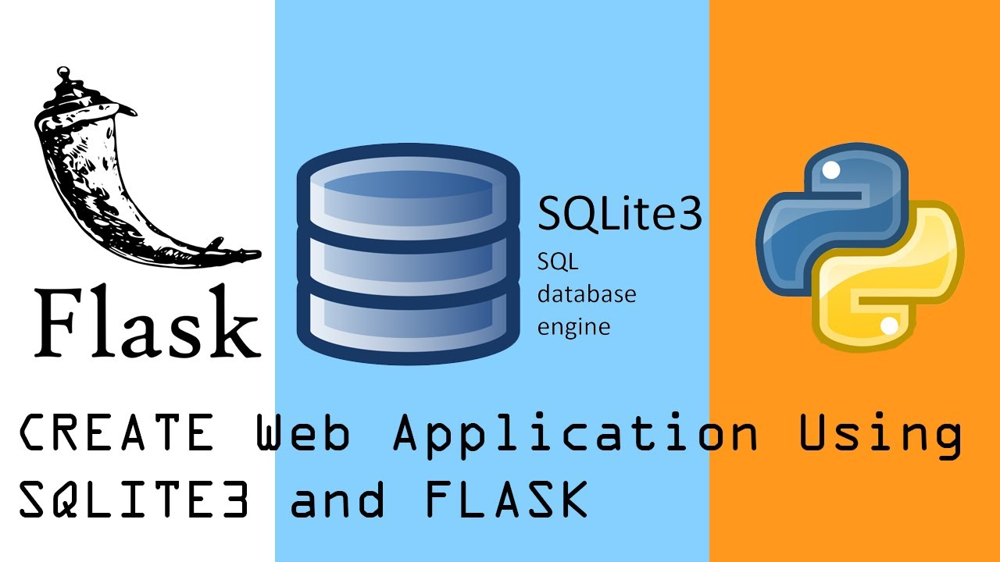
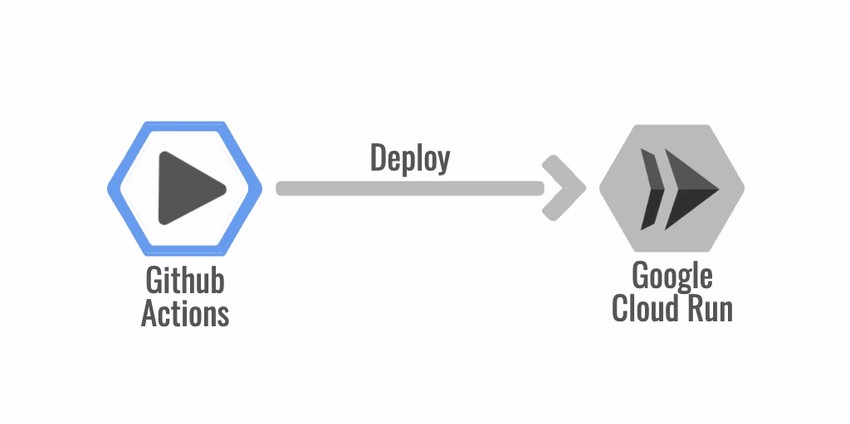

# Assignment 2 : MGMT 590, Production Scale Data Products, Summer 2021

## Creating Flask Application - Question Answering

Purpose of the this hands-on project was to create a REST API inference server that serves inferences from a Transformers NLP model
The app is deployed at: https://mgmt590-assignment-2-kbmrvvvzgq-uc.a.run.app




## Learning Outcomes

At the end of the this hands-on training, students will be able to;

- Understand client-server software architecture.

- Get familiar with Python Flask framework.

- Automated deploy using a GitHub Action that executes the following on merges into the
master branch of your GitHub repository

- Build an API accessible on the public Internet

- Use git repo to manage the application versioning.

- Using a SQLite database to log all answered questions

## Outline

- Part 1 - Question Answering using NLP Transformers 

- Part 2 - Getting to know the Python Flask framework

- Part 3 - Dependencies

- Part 4 - REST API endpoints

- Part 5 - Building and running the API locally

- Part 6 - CI/CD with Github Actions and Google Cloud Run


## Part 1 - Question Answering using NLP Transformer

Question answering is a task in information retrieval and Natural Language Processing (NLP) that investigates software that can answer questions asked by humans in natural language. In Extractive Question Answering, a context is provided so that the model can refer to it and make predictions on where the answer lies within the passage.

To immediately use a model on a given text, we provide the `pipeline` API. Pipelines group together a pretrained model with the preprocessing that was used during that model's training. Here is how to quickly use a pipeline to classify positive versus negative texts:

```python
from transformers import pipeline

# Allocate a pipeline for sentiment-analysis
classifier = pipeline('sentiment-analysis')
classifier('We are very happy to introduce pipeline to the transformers repository.')
[{'label': 'POSITIVE', 'score': 0.9996980428695679}]
```

The second line of code downloads and caches the pretrained model used by the pipeline, while the third evaluates it on the given text. Here the answer is "positive" with a confidence of 99.97%.

Many NLP tasks have a pre-trained `pipeline` ready to go. For example, we can easily extract question answers given context:

``` python
from transformers import pipeline

# Allocate a pipeline for question-answering
question_answerer = pipeline('question-answering')
question_answerer({
...     'question': 'What is the name of the repository ?',
...     'context': 'Pipeline has been included in the huggingface/transformers repository'
... })
{'score': 0.30970096588134766, 'start': 34, 'end': 58, 'answer': 'huggingface/transformers'}

```

In addition to the answer, the pretrained model used here returned its confidence score, along with the start position and end position of the answer in the tokenized sentence. You can learn more about the tasks supported by the `pipeline` API in [this tutorial](https://huggingface.co/transformers/task_summary.html).

To download and use any of the pretrained models on your given task, all it takes is three lines of code. Here is the PyTorch version:
```python
from transformers import AutoTokenizer, AutoModel

tokenizer = AutoTokenizer.from_pretrained("bert-base-uncased")
model = AutoModel.from_pretrained("bert-base-uncased")

inputs = tokenizer("Hello world!", return_tensors="pt")
outputs = model(**inputs)
```
And here is the equivalent code for TensorFlow:
```python
from transformers import AutoTokenizer, TFAutoModel

tokenizer = AutoTokenizer.from_pretrained("bert-base-uncased")
model = TFAutoModel.from_pretrained("bert-base-uncased")

inputs = tokenizer("Hello world!", return_tensors="tf")
outputs = model(**inputs)
```

The tokenizer is responsible for all the preprocessing the pretrained model expects, and can be called directly on a single string (as in the above examples) or a list. It will output a dictionary that you can use in downstream code or simply directly pass to your model using the ** argument unpacking operator.

The model itself is a regular [Pytorch `nn.Module`](https://pytorch.org/docs/stable/nn.html#torch.nn.Module) or a [TensorFlow `tf.keras.Model`](https://www.tensorflow.org/api_docs/python/tf/keras/Model) (depending on your backend) which you can use normally. [This tutorial](https://huggingface.co/transformers/training.html) explains how to integrate such a model into a classic PyTorch or TensorFlow training loop, or how to use our `Trainer` API to quickly fine-tune on a new dataset.

## Why should I use transformers?

1. Easy-to-use state-of-the-art models:
    - High performance on NLU and NLG tasks.
    - Low barrier to entry for educators and practitioners.
    - Few user-facing abstractions with just three classes to learn.
    - A unified API for using all our pretrained models.

1. Lower compute costs, smaller carbon footprint:
    - Researchers can share trained models instead of always retraining.
    - Practitioners can reduce compute time and production costs.
    - Dozens of architectures with over 2,000 pretrained models, some in more than 100 languages.

1. Choose the right framework for every part of a model's lifetime:
    - Train state-of-the-art models in 3 lines of code.
    - Move a single model between TF2.0/PyTorch frameworks at will.
    - Seamlessly pick the right framework for training, evaluation and production.

1. Easily customize a model or an example to your needs:
    - We provide examples for each architecture to reproduce the results published by its original authors.
    - Model internals are exposed as consistently as possible.
    - Model files can be used independently of the library for quick experiments.

## Why shouldn't I use transformers?

- This library is not a modular toolbox of building blocks for neural nets. The code in the model files is not refactored with additional abstractions on purpose, so that researchers can quickly iterate on each of the models without diving into additional abstractions/files.
- The training API is not intended to work on any model but is optimized to work with the models provided by the library. For generic machine learning loops, you should use another library.
- While we strive to present as many use cases as possible, the scripts in our [examples folder](https://github.com/huggingface/transformers/tree/master/examples) are just that: examples. It is expected that they won't work out-of-the box on your specific problem and that you will be required to change a few lines of code to adapt them to your needs.

## Installation

### With pip

This repository is tested on Python 3.6+, Flax 0.3.2+, PyTorch 1.3.1+ and TensorFlow 2.3+.

You should install 🤗 Transformers in a [virtual environment](https://docs.python.org/3/library/venv.html). If you're unfamiliar with Python virtual environments, check out the [user guide](https://packaging.python.org/guides/installing-using-pip-and-virtual-environments/).

First, create a virtual environment with the version of Python you're going to use and activate it.

Then, you will need to install at least one of Flax, PyTorch or TensorFlow.
Please refer to [TensorFlow installation page](https://www.tensorflow.org/install/), [PyTorch installation page](https://pytorch.org/get-started/locally/#start-locally) and/or [Flax installation page](https://github.com/google/flax#quick-install) regarding the specific install command for your platform.

When one of those backends has been installed, 🤗 Transformers can be installed using pip as follows:

```bash
pip install transformers
```

If you'd like to play with the examples or need the bleeding edge of the code and can't wait for a new release, you must [install the library from source](https://huggingface.co/transformers/installation.html#installing-from-source).

### With conda

Since Transformers version v4.0.0, we now have a conda channel: `huggingface`.

🤗 Transformers can be installed using conda as follows:

```shell script
conda install -c huggingface transformers
```

Follow the installation pages of Flax, PyTorch or TensorFlow to see how to install them with conda.


## Part 2 - Getting to know the Python Flask framework


Flask is a lightweight [WSGI](https://wsgi.readthedocs.io/) web
application framework. It is designed to make getting started quick and
easy, with the ability to scale up to complex applications. It began as
a simple wrapper around
[Werkzeug](https://werkzeug.palletsprojects.com/) and
[Jinja](https://jinja.palletsprojects.com/) and has become one of the
most popular Python web application frameworks.

Flask offers suggestions, but doesn't enforce any dependencies or
project layout. It is up to the developer to choose the tools and
libraries they want to use. There are many extensions provided by the
community that make adding new functionality easy.

Installing
----------

Install and update using
[pip](https://pip.pypa.io/en/stable/quickstart/):

``` {.sourceCode .text}
$ pip install -U Flask
```

A Simple Example
----------------

```python
# save this as webapp.py
from flask import Flask

app = Flask(__name__)

@app.route("/")
def hello():
    return "Hello, World!"
```

```bash
$ flask run
  * Running on http://127.0.0.1:5000/ (Press CTRL+C to quit)
```

# Flask RESTful API SQLite3

This project is created with `python` and `flask` and for the database utility
I have used `sqlite3`.


## 

The API information will be stored in a file `prodscale.db` which will act as the SQLite database.
To generate this file, *and with it the tables*, a function `create_table` is triggered from `app.py`.

You will then be able to add new data and do  CRUD operation(s).

## Part -3 Dependencies

The Dependencies are in the `requirements.txt` namely:

Flask==1.1.2

transformers==4.2.2

if you want to exactly rebuild the development environment
run the following command:

    (venv) $ pip install -r requirements.txt
    
The required packages are outdated very quickly and you can try to use newer versions.
If you experience problems you can always go back and use the version specified here.

To generate your own requirements file use

    (venv) $ pip freeze >requirements.txt 

## Part-4 The available endpoints are:


##List Available Models
- GET  `/models`: This route allows a user to obtain a list of the models currently loaded into the server and available for inference :

Expected Response Format :

  ```json
[
    {
        "name": "distilled-bert",
        "tokenizer": "distilbert-base-uncased-distilled-squad",
        "model": "distilbert-base-uncased-distilled-squad"
    },
    {
        "name": "deepset-roberta",
        "tokenizer": "deepset/roberta-base-squad2",
        "model": "deepset/roberta-base-squad2"
    }
]
  ```

## Add a Model
- PUT  `/models`: This route allows a user to add a new model into the server and make it available for inference.

Expected Request Format :

  ```json
    {
        "name": "distilled-bert",
        "tokenizer": "distilbert-base-uncased-distilled-squad",
        "model": "distilbert-base-uncased-distilled-squad"
    }
  ```

Expected Response Format :

  ```json
[
    {
        "name": "distilled-bert",
        "tokenizer": "distilbert-base-uncased-distilled-squad",
        "model": "distilbert-base-uncased-distilled-squad"
    },
    {
        "name": "deepset-roberta",
        "tokenizer": "deepset/roberta-base-squad2",
        "model": "deepset/roberta-base-squad2"
    }
]
  ```
## Delete a Model

- DELETE   `/models?model=<model name>`: This route allows a user to delete an existing model on the server such that it is no longer available for inference.

Query Parameters:
`<model name> (required) - The name of the model to be deleted`

Expected Response Format(updated list of available models) :

  ```json
[
    {
        "name": "distilled-bert",
        "tokenizer": "distilbert-base-uncased-distilled-squad",
        "model": "distilbert-base-uncased-distilled-squad"
    },
    {
        "name": "deepset-roberta",
        "tokenizer": "deepset/roberta-base-squad2",
        "model": "deepset/roberta-base-squad2"
    }
]
  ```

## Answer a Question

- POST  `/answer?model=<model name>`: This route uses one of the available models to answer a question, given the context provided in the JSON payload.

Query Parameters:
`<model name> (optional) - The name of the model to be used in answering the
question. If no model name is provided use a default model.`

Expected Request Format :

  ```json
{
  "question": "who did holly matthews play in waterloo rd?",
  "context": "She attended the British drama school East 15 in 2005,and left after winning a high-profile role in the BBC drama Waterloo Road, playing the bully Leigh-Ann Galloway.[6] Since that role, Matthews has continued to act in BBC's Doctors, playing Connie Whitfield; in ITV's The Bill playing drug addict Josie Clarke; and she was back in the BBC soap Doctors in 2009, playing Tansy Flack."
}
  ```

Expected Response Format :

  ```json
{
  "timestamp": 1621602784,
  "model": "deepset-roberta",
  "answer": "Leigh-Ann Galloway",
  "question": "who did holly matthews play in waterloo rd?",
  "context": "She attended the British drama school East 15 in 2005,and left after winning a high-profile role in the BBC drama Waterloo Road, playing the bully Leigh-Ann Galloway.[6] Since that role, Matthews has continued to act in BBC's Doctors, playing Connie Whitfield; in ITV's The Bill playing drug addict Josie Clarke; and she was back in the BBC soap Doctors in 2009, playing Tansy Flack."
}
  ```
##List Recently Answered Questions

- GET  `/answer?model=<model name>&start=<start timestamp>&end=<end
timestamp>`: This route returns recently answered questions
  
Query Parameters:

`<model name> (optional) - Filter the results by providing a certain model name, such
that the results only include answered questions that were answered using the provided
model.`

`<start timestamp> (required) - The starting timestamp, such that answers to questions
prior to this timestamp won't be returned. This should be a Unix timestamp.`

`<end timestamp> (required) - The ending timestamp, such that answers to questions
after this timestamp won't be returned. This should be a Unix timestamp.`

Expected Response Format :

  ```json
[
    {
        "timestamp": 1622100672,
        "model": "distilled-bert",
        "answer": "Leigh-Ann Galloway",
        "question": "who did holly matthews play in waterloo rd?",
        "context": "She attended the British drama school East 15 in 2005,and left after winning a high-profile role in the BBC drama Waterloo Road, playing the bully Leigh-Ann Galloway.[6] Since that role, Matthews has continued to act in BBC's Doctors, playing Connie Whitfield; in ITV's The Bill playing drug addict Josie Clarke; and she was back in the BBC soap Doctors in 2009, playing Tansy Flack."
    },
    {
        "timestamp": 1622100683,
        "model": "distilled-bert",
        "answer": "Leigh-Ann Galloway",
        "question": "who did holly matthews play in waterloo rd?",
        "context": "She attended the British drama school East 15 in 2005,and left after winning a high-profile role in the BBC drama Waterloo Road, playing the bully Leigh-Ann Galloway.[6] Since that role, Matthews has continued to act in BBC's Doctors, playing Connie Whitfield; in ITV's The Bill playing drug addict Josie Clarke; and she was back in the BBC soap Doctors in 2009, playing Tansy Flack."
    }
]
 ```
## Part 5 : Building and running the API locally

### Running Locally with Python and Flask

To run this application on your local operating system, you will need to have
[Python installed](https://www.python.org/downloads/).

1. Install required dependencies using the Python package installer (`pip`):

   ```
   $ pip install -r requirements.txt
   ```

1. Run the app:

   ```
   $ FLASK_APP=answers.py flask run
   ```

1. Navigate to `http://localhost:8080` in your web browser to access the running
   application

### Running Locally with Docker

This application may be run locally using
[Docker](https://docs.docker.com/get-docker/).

1. Build the Docker image:

   ```
   $ docker build -t mgmt590-assignment-2
   ```

1. Run the docker container:
   ```
   $ docker run --env PORT=8080 -p 8080:8080 mgmt590-assignment-2
   ```

1. Navigate to `http://localhost:8080` in your web browser to access the running
   application

### Deploying with Google Cloud Run

This application can be deployed to Google Cloud Run. This requires a Google
account.

1. Select or create a Google Cloud project using the
[Google Cloud Console](https://console.cloud.google.com/projectselector2/home/dashboard)

1. Install and initialize the [Google Cloud SDK](https://cloud.google.com/sdk/docs/install)

1. Build and deploy the application to Google Cloud Run, following the on-screen
   prompts:

   ```
   $ export PROJECT_ID=$(gcloud config get-value project)
   $ gcloud builds submit --tag gcr.io/$PROJECT_ID/py-calc
   $ gcloud run deploy --image gcr.io/$PROJECT_ID/py-calc --platform managed
   ```

1. When complete, the last command execute in the previous step will display the
   URL of deployed application; navigate to that URL in your web browser to
   access the application.
   
## Part 6 - CI/CD with Github Actions and Google Cloud Runs

To automate the process of building and deploying images to Google Cloud Run, we can utilize Google Cloud Run GitHub Action. 

Related documentation is available [here](https://github.com/GoogleCloudPlatform/github-actions/blob/master/example-workflows/cloud-run/README.md).

# Pre-requisites

1. [Create a Google Cloud Service Account](https://cloud.google.com/iam/docs/creating-managing-service-accounts)

2. Add the following Cloud IAM roles

`Cloud Run Admin`

`Cloud Build Editor`

`Cloud Build Service Account`

`Viewer`

`Service Account User`

3. [Create a Service Account JSON key](https://cloud.google.com/iam/docs/creating-managing-service-account-keys)

4. Add a GitHub Secret to your repository:

`RUN_SA_KEY` : Content of service account JSON Key that was generated in previous step.

5. Set workflow variables

`PROJECT_ID` : Google Cloud Project ID

`SERVICE_NAME` : Service Name. This name will be used as the image name and service name.

# Example GitHub Action Workflow

```
    # Setup GCloud CLI
    - uses: GoogleCloudPlatform/github-actions/setup-gcloud@master
      with:
        version: '286.0.0'
        service_account_key: ${{ secrets.RUN_SA_KEY }}
        project_id: $PROJECT_ID

    # Build and push image to Google Container Registry
    - name: Build
      run: |-
        gcloud builds submit \
          --quiet \
          --tag "gcr.io/$PROJECT_ID/$SERVICE_NAME:$GITHUB_SHA"

    # Deploy image to Cloud Run
    - name: Deploy
      run: |-
        gcloud run deploy "$SERVICE_NAME" \
          --quiet \
          --region "$RUN_REGION" \ # E.g. centralus1
          --image "gcr.io/$PROJECT_ID/$SERVICE_NAME:$GITHUB_SHA" \
          --platform "managed" \
          --allow-unauthenticated
```