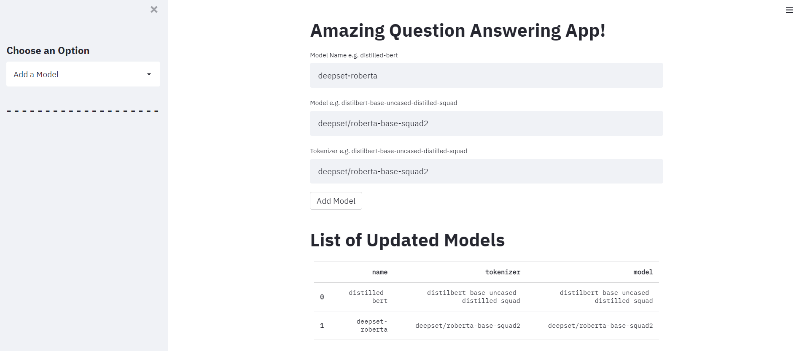
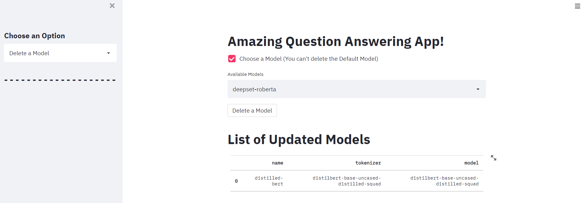
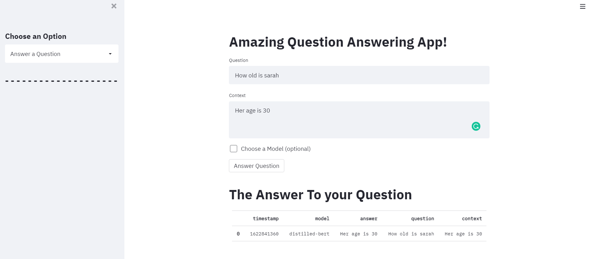

# Assignment 3 : Streamlit App+ REST API+ PostgreSQL

## Architecture and Flow of the entire project 


## REST API architecture


## Purpose of the Question Answering App

Motive of the assignment was to create a Question Answering Web App using Stream Lit and link it to the API created in assignment 2. This app will give a front end user to access API.
The link to app: https://mgmt590-webapp-ykof2ki2ga-uc.a.run.app

## Topics explored and learned

By working on this assignment I got familiar with the following:

- Understood the flow and achitechture of the Webapp and the rest api connection

- Get fimiliar with the Streamlit functions and content

- How github actions autodeploy to gcloud

- Using POSTGRESQL on Gcloud for storing data from API.

- Use git repo for version control.

- How to make an application that is publicly accesible

##I) Idea behind the app 
## Creating the - Question Answering web app
The objective for this project was to deploy a web app created on the foundation of a REST API created previously.
The webapp integrates Natural Language Processing algorithms such as the Hugging Face Transformers to enable automated Question Answering. 
In brief, Question Answering is method of information retrieval that uses Machine Learning to extract answers for questions asked by humans in natural language. In Extractive Question Answering, a context is provided so that the model can refer to it and make predictions on where the answer lies within the passage.

The app is deployed at: https://mgmt590-webapp-ykof2ki2ga-uc.a.run.app/

Firstly, we created an API. We used Flask, a web framework for Python that provides functionality for building web applications, including managing HTTP requests and rendering templates. The advantage of using Flask is that applications tend to be written on a blank canvas, so to speak, and so are more suited to a contained application such as our prototype API. Further, we used the prevailing design philosophy of modern APIs called REST. REST is based on four methods defined by the HTTP protocol: POST, GET, PUT, and DELETE. These correspond to the four traditional actions performed on data in a database: CREATE, READ, UPDATE, and DELETE. We finally tested our REST API on Google Cloud Run and got desirable results. 

We covered more about creating a REST API in a previous project which can be found here: https://github.com/saiteja-2811/mgmt590-lec2/blob/master/README.md

##II)  User guide for the app 
After successfully creating the REST API, the next step was to create a user interface. A user interface is what the final user will experience on the web app. 
It is built upon a skeleton code which is the REST API. 
For this purpose, we used the Streamlit framework, in which you can build a browser-based UI using only Python code. 
Streamlit contains built-in widgets for user input like image-uploading, sliders, text input, and other familiar HTML elements like checkboxes and radio buttons.

## User Guide

### Below is the preview to all the functionalities of the web application.

- Get List of Models : Used to get list of models in the DB 


- Insert a model : Used to insert a model with the model name, model type, tokenizer of the model. ()


- Delete a model
- 

- Get Answers
- 

- Recently Answered Questions
- 

- File Upload and get answers
- 

## Dependencies

The Dependencies are in the `requirements.txt` namely:

Flask==1.1.2

transformers[torch]==4.2.2

requests==2.25.1

streamlit==0.82.0

pandas==1.1.5

pytest==6.2.4

freezegun==1.1.0

mock==4.0.3

if you want to exactly rebuild the development environment
run the following command:

    (venv) $ pip install -r requirements.txt
    
The required packages are outdated very quickly and you can try to use newer versions.
If you experience problems you can always go back and use the version specified here.

To generate your own requirements file use

    (venv) $ pip freeze >requirements.txt
## ## Usage
### Without Docker
To run the dashboard, please execute the following from the root directory:
```bash
pip3 install -r requirements.txt
streamlit run dashboard.py
```
When run locally, the dashboard is accessible here:
```
http://localhost:8501
```

### With Docker
To run the web app using Docker containers, please execute the following from the root directory:
```bash
docker build -t dashboard .
docker run -d --name dashboard -p 8501:8501 dashboard
```
 
 
 
